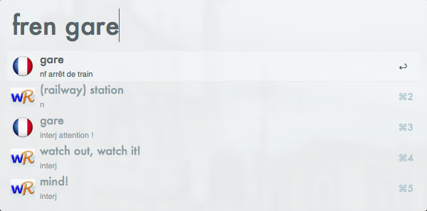
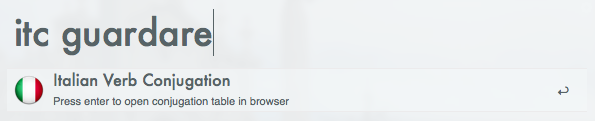

For the language learners among us, here's a workflow that returns results from http://wordreference.com into Alfred.

 
As you can see from the screenshot, you'll get various definitions in the original language (designated using the relevant flag), with each definition proceeded by translations in the target language (parts of speech and the gender of nouns (where applicable) are also included). Pressing enter will take you to the entry page on wordreference.com.
 
Numerous dictionaries are included (I can add additional ones carried by the WordReference website if there are any requests), with the specific dictionary called up using the first two letters of the original language followed by the first two letters of the target language. That means:
 
`enfr`: English to French
`fren`: French to English
`enit`: English to Italian
`iten`: Italian to English
`enes`: English to Spanish
`esen`: Spanish to English
 
In addition, typing frc, itc or esc, followed by a verb (in French, Italian or Spanish respectively) and then pressing enter will call up (in your browser) the conjugation table for the verb. For example:

 
Lastly, note that in order to use the workflow you must first register for an API with wordreference.com (this is necessary to prevent excessive calls from any given API). That can be done by using the 'getapi' keyword in Alfred, or using this link: http://www.wordreference.com/docs/APIregistration.aspx. You then set the API by using the 'setapi' keyword. 
 
And just in case you "tl:dr" that:

 
 
[DOWNLOAD](http://www.alfredforum.com/topic/2590-wordreference-a-multilingual-translation-dictionary/)
 
 
Updates will be released via Alleyoop 2 and posted here. Let me know if you've got any feedback.